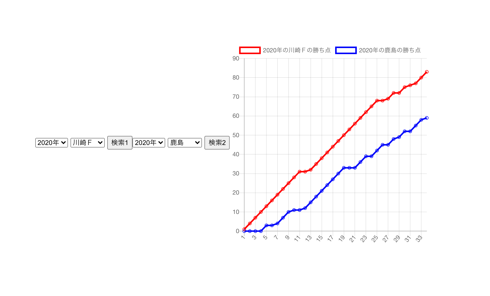

# J検索くん(勝ち点の推移)フロント
- サッカーJリーグのデータをスクレイピングしたWebAPIからデータを受け取りグラフを表示。
- J1の2016~2020のチームの勝ち点の推移をみることができる。
- [こちらから検索サイトに飛べます](https://yuta97.github.io/j-result-front-nuxt/)
- フロントの検索画面

<!-- 画像がずれてるので配置とサイズ修正 -->

<!-- # 全体の構成・使用技術・ライブラリなど -->
# 使用技術
- Javascript (Nuxt.js,Chart.js)

<!-- # 使い方 -->

# 作成者
増井　悠太